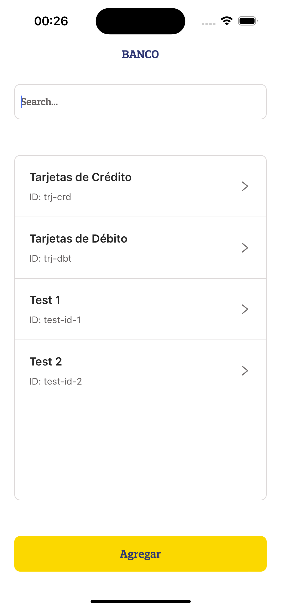
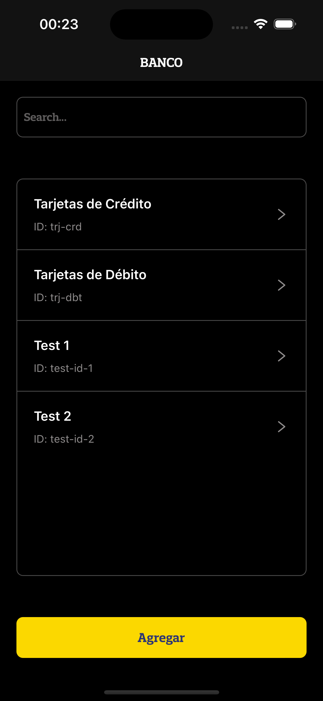
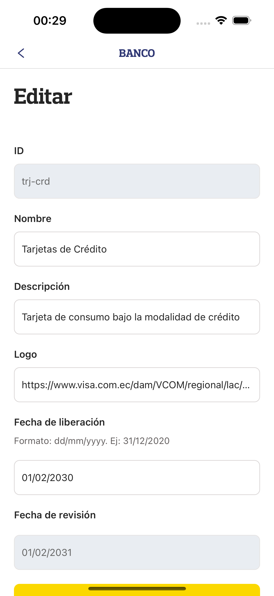
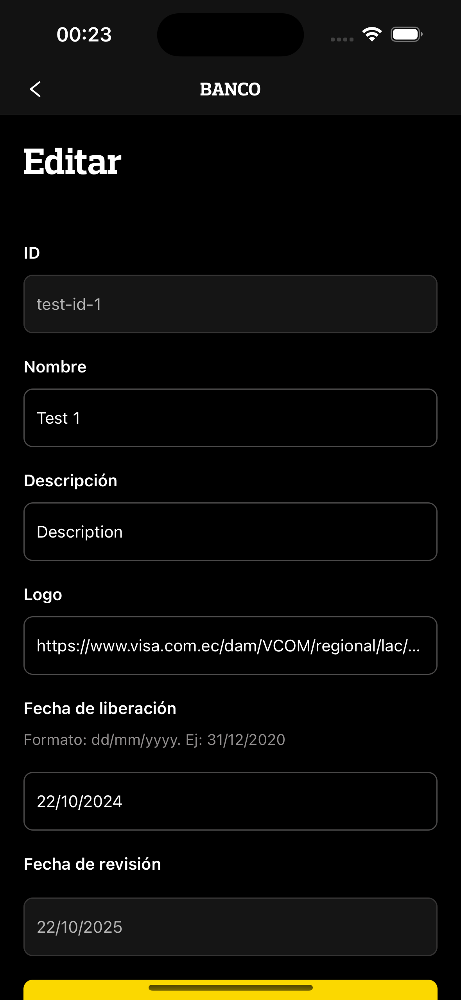
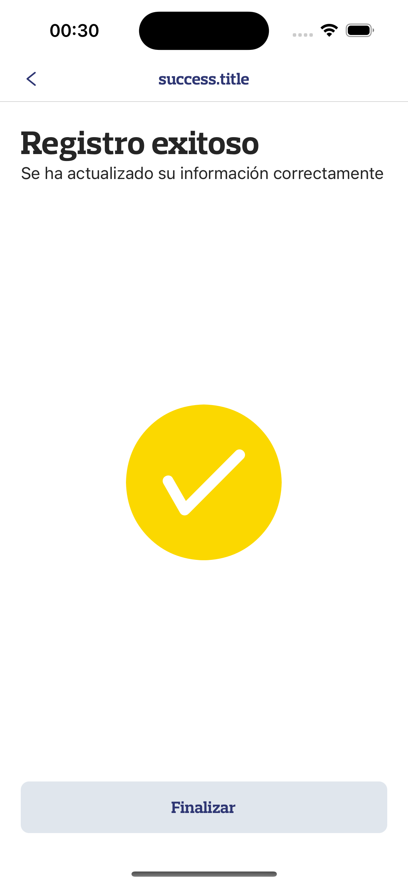
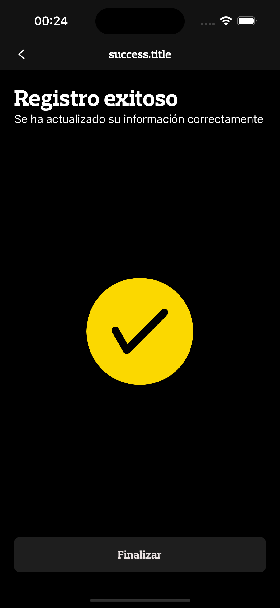
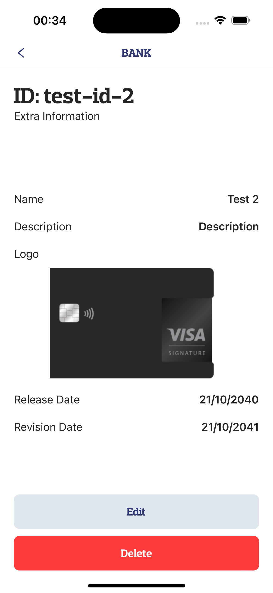
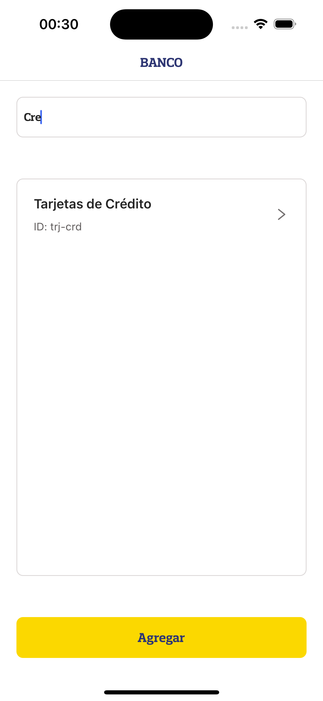

# Sofka interview challenge

## Tasks 💼
- [x] F1. List financial products
- [x] F2. Search financial products
- [x] F3. List financial products
- [x] F4. Add financial products
- [x] F5. Update financial products
- [x] F6. Delete financial products

# Introduction 🔒
This is a hybrid mobile application built with React Native and Expo. It is a simple financial products management system that allows users to list, search, add, update and delete financial products.
It was made for a Sofka interview challenge for a **Senior React Native developer** position. 🧑🏻‍💻

## Prerequisites 🤝
- `Node.js` (v18 or higher)
- `npm` (v10.1.0 or higher)
- `Expo CLI` (v0.18.9 or higher)
- `Expo Go app on your phone or an emulator` (SKD 52.0.0 or higher)

## Installing and running 🏃🏻‍ 
1. Clone the repository
2. Run `npm install -f` to install the dependencies (-f is to force the installation, It's not really necessary)
3. Generate a `.env` file with the following content:
    ```env
    EXPO_PUBLIC_AUTHOR_ID=DEVELOPER_KEY
    EXPO_PUBLIC_BASE_URL=https://tribu-ti-staffing-desarrollo-afangwbmcrhucqfh.z01.azurefd.net/ipf-msa-productosfinancieros
    ```
    > You can use the provided .env.example file as a template by executing: `cp .env.example .env`
3. Run `npm start` to start the application
4. Scan the QR code with the Expo Go app on your phone or use an emulator
    > If you are using an emulator, you can press `a` to open the app on an Android emulator or `i` to open the app on an iOS emulator automatically
5. Test the app! 🚀

## Testing 🧪
This project was tested on an iOS-Android emulator and a physical iOS device. It should work on Android devices as well.
To run the tests, you can execute:
```bash
npm test
```

And with coverage:
```bash
npm run test:cover
```

> The coverage is not 100% because some components are not tested, but the most important parts are covered.

Coverage report will be available at `./coverage/lcov-report/index.html` after running the tests.

## Additional Features 👽
- **Dark mode** 🌚
  - App can listen device's system theme and change the app theme accordingly:
    
    
    
    
    
    

- **Internationalization** 🌍
  - App can be translated to English and Spanish or any other language:<br/>
  
     
- **Dice based search engine** 🔎
  - App can search products by name using a similar search engine:<br/>
  
    
- **Haptic feedback** ??
    - App provides haptic feedback when a button is pressed, feel it! 🤤

## Technologies 🏍️
This project was built with the following technologies:
- React Native
- Typescript
- Expo
- Expo Router
- i18next

## Author 👋
- [Juan Jaramillo](https://github.com/juanjodev02)


